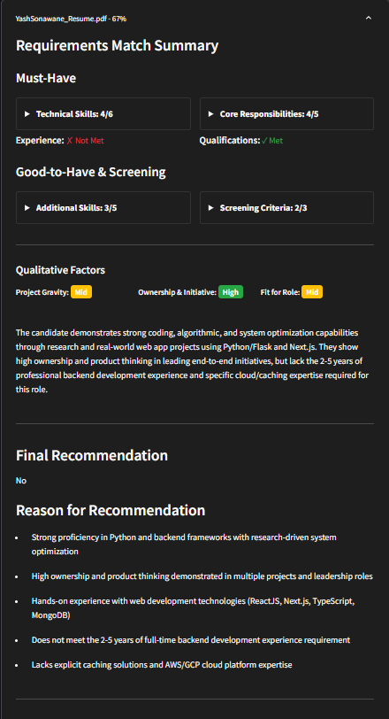

# Resume Analysis System

A powerful resume analysis tool that compares candidate resumes against job descriptions using AI to provide detailed insights and rankings. Built by [Mercity-AI](https://www.mercity.ai/).

## 🎥 Demo

🎥 [Check out our demo video!](https://www.loom.com/share/3985f56862074443b058e705fc47590a?sid=c73d3e56-d262-491b-8a1d-9fc49a89bc41)

## 🌟 Features



- **Real-time Analysis**:
  - Process multiple resumes simultaneously
  - Live progress tracking
  - Instant results display

- **Smart Matching**:
  - AI-powered comparison of resumes against job requirements
  - Detailed requirement matching
  - Percentage-based scoring system

- **Comprehensive Analysis**:
  - Technical skills assessment
  - Core responsibility matching
  - Qualitative evaluation of experience
  - Project gravity analysis
  - Candidate fit scoring
  - Recruiter-style summaries

- **Interactive Results**:
  - Clean, modern UI with expandable sections
  - Percentage match scores
  - Detailed requirement breakdowns
  - Final recommendations with key factors
  - Color-coded qualitative assessments

- **Export Functionality**:
  - Download complete analysis results as CSV
  - Structured data export for further processing

## 🚀 Getting Started

### Prerequisites

- Python 3.8 or higher
- OpenAI API key
- Git

### Installation

1. Clone the repository:
```bash
git clone https://github.com/Mercity-AI/Resume-Analyzer.git
cd Resume-Analyzer
```

2. Install required packages:
```bash
pip install -r requirements.txt
```

3. Set up your environment variables (optional):
   - Create a `.env` file in the root directory
   - Add your OpenAI API key:
```
OPENAI_API_KEY=your_api_key_here
```
   - Note: You can also enter your API key directly in the application

### Running the Application

1. Start the Streamlit app:
```bash
streamlit run app.py
```

2. Open your browser and navigate to the displayed URL (typically `http://localhost:8501`)

## 📝 Usage

1. **API Key Setup**
   - Enter your OpenAI API key when prompted
   - The key will be verified before proceeding
   - You can change the API key at any time

2. **Model Selection**
   - Choose your preferred primary model for job description analysis
   - Select a reasoning-focused model for resume evaluation
   - Update models as needed during usage

3. **Job Description Analysis**
   - Paste the job description
   - Click "Analyze Job Description"
   - Review and edit extracted requirements if needed

4. **Resume Analysis**
   - Upload one or more resumes (PDF, DOCX, or TXT)
   - Click "Analyze Resumes"
   - View real-time analysis progress
   - Review detailed results for each candidate

5. **Results Review**
   - Examine detailed matching scores
   - Review qualitative assessments
   - Read recruiter-style summaries
   - Check final recommendations
   - Export results to CSV if needed

## 🔒 Security

- API keys are securely handled and not stored permanently
- All analysis is performed through secure API calls
- No resume data is stored after analysis

## 📊 Output Format

The analysis provides:
- Overall match percentage
- Technical skills assessment
- Core responsibilities matching
- Experience and qualification verification
- Project evaluation
- Detailed recommendations
- Exportable CSV report

## 🤝 Contributing

Contributions are welcome! Please feel free to submit a Pull Request.

## 📄 License

This project is licensed under the MIT License - see the LICENSE file for details.

## 🔍 Analysis Components

- **Requirements Match**:
  - Must-have technical skills
  - Core responsibilities
  - Experience requirements
  - Qualifications

- **Qualitative Assessment**:
  - Project gravity
  - Ownership and initiative
  - Role transferability
  - Strengths and weaknesses

- **Final Evaluation**:
  - Match percentage
  - Recruiter summary
  - Final recommendation
  - Key factors for decision

## 🛠️ Technical Details

- Built with Streamlit for the user interface
- Uses OpenAI's GPT models for analysis
- Supports PDF, DOCX, and TXT file formats
- Real-time processing and display
- Session state management for consistent results

## 📊 CSV Export Format

The exported CSV includes detailed columns for:
- Contact information
- Technical skills assessment
- Core responsibility matching
- Additional skills evaluation
- Screening criteria results
- Qualitative assessments
- Final recommendations

## 🙏 Acknowledgments

- OpenAI for providing the AI models
- Streamlit for the amazing web framework
- All contributors and users of this project 